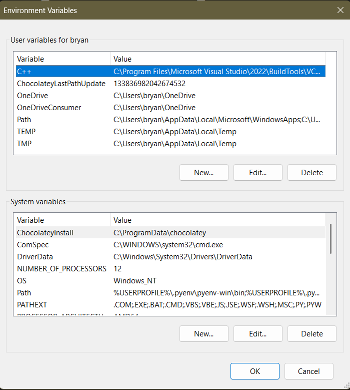
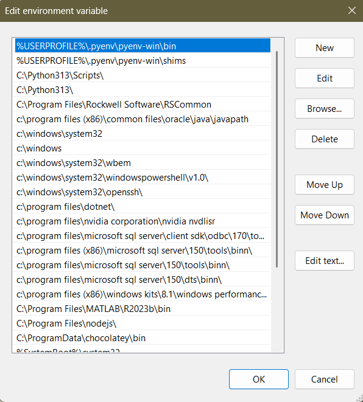

# Depth Anything Introduction
By Bryan Steines and Evan Jenkins  

Depth Anything is a computer vision algorthim which estimates depth with from an image or video taken by a singular camera. Robotics applications previously had to use two cameras to calculate depth, but this can be expensive and harder to design for.

## Use Cases
Depth anything is useful in areas where depth perception is useful but does not need to be extremely accurate. Some robotics use cases are as follows:

- Obstacle Avoidance: Depth perception is important for robotic ground vehicles, but especially when close to obstacles
- Human Action Observation: Depth perception is important for identifying the distance between people moving, making it possible to track human movement
- Gesture Recognition: Depth perception is important for distinguishing the movement seen by someone's hands or limbs, making it useful in identifying gestures
- Terrain Mapping: Depth perception is important for determining the relative distance and height between different objects, making it useful for mapping elevation

# Installation steps/considerations
  - This tutorial is very short and easy to follow, so if you have any unexpected issues it is your fault and you should give up your dreams and learn to be journalist
  - This installation walkthrough is specifically for windows, other operating systems may have an easier time installing the depthAnythingV2 project on their own
  - This project works best on python 3.10
    - Other versions such as 3.11 may work but 3.13 does not
    - To handle this I suggest installing pyenv-win which allows us to handle multiple python installations
  - This project may require specific versions of python packages
    - To handle this the installation steps include the set-up of a virtual environment, but this is technically optional
  - A GPU will allow for faster operation
      
## Pyenv-win Installation Steps

1. Install pyenv-win with following command in a terminal:
    - If an error pops up because running scripts is disabled, proceed to troubleshooting as you will need this for later anyways
```
Invoke-WebRequest -UseBasicParsing -Uri "https://raw.githubusercontent.com/pyenv-win/pyenv-win/master/pyenv-win/install-pyenv-win.ps1" -OutFile "./install-pyenv-win.ps1"; &"./install-pyenv-win.ps1"
```
2. Confirm installation by running ```pyenv --version```
    - You may need to close and reopen the terminal
3. Older python versions can be found by first running the ```pyenv install -l``` command to see what versions are compatible with pyenv-win
4. The desired version can be installed with a command such as  ```pyenv install 3.10.5```, 3.10.5 is recommended for this installation
5. Now the python version of your system can be changed with the ```pyenv global <version>``` command  
    -Any directory can be given its own python version with the ```pyenv local <version>``` command  
6. Run ```python --version``` to check the python version within a given directory
  
It is very likely pyenv-win does not work immediately, to fix this it must be placed in your path above any other python installation  
The following steps should remedy the issue  
1. Search environment variables in your system search bar
2. Open system properties, you should be within the "advanced" tab
3. Click environment variables, this should bring you to a screen similar to the following:  
    
  
  
4. Within the system variables block on the bottom, double click the variable labelled **Path**. This should bring you to the following screen:  
  
  
  
To give pyenv-win priority over other python installations on your computer, we have to add two of its directories onto the path, and place them above any other python installations you may have. If you need to return to a previous python install, just move it above the pyenv-win paths.   
  
5. Add the following two directories into your path variable by copying them, clicking new, and pasting one at a time.  
```%USERPROFILE%\.pyenv\pyenv-win\bin```   
```%USERPROFILE%\.pyenv\pyenv-win\shims```
6. Move these new paths above any python installs by using the move up and move down buttons
7. Verify this has worked by restarting your terminal window and running ```python --version```


## Optional Quality of Life Steps
These steps are to set up the py-env version and virtual environment within a new directory on your machine.  
These do not have to be followed if you have a machine entirely devoted to DepthAnythingV2  
1. Make a new folder for the depthAnythingV2 install on your computer
### Set up py-env
1. If you are using py-env, open this directory and run ```pyenv local 3.10.5``` to set the python version within it
1. Run ```python --version``` to confirm
### Set up the virtual environment
By using a virtual environment, you can contain any installed packages to this folder for easy version management and deletion later
1. Create a virtual environment with ```python -m venv depthV2Env```
1. Enter into the virtual environment with ```.\depthV2Env\Scripts\activate```. If there is an error due to running scripts proceed to troubleshooting and then return. 
    - To exit the virtual enironment use the command ```deactivate``` 
#### Important Note
The depth anything repository does not need to be installed within the virtual environment, only run while the environment is active in the command line.  
I suggest cloning the repository into the same directory you created the virtual environment in.
  
With these ironed you can now proceed with the rest of the tutorial


## DepthAnything

1. First enter into your desired directory for the depthAnythingV2 Project to be stored
1. Within this directory, run the following command to clone DepthAnythingV2:
```
git clone https://github.com/DepthAnything/Depth-Anything-V2
```
3. Once downloaded, enter into the project: ```cd Depth-Anything-V2```
4. Download the dependencies by running
```
pip install -r requirements.txt
```
5. Install the transformers package separately 
```
pip install transformers
```
6. One of the packages installed is bad, so we have to install a different version. Paste the following commands into your terminal:
```
pip uninstall fastapi -y
pip install fastapi==0.112.4
```
7. To use a pretrained model, create a folder within your current directory named "checkpoints"
7. Download your chose pretrained model from here: https://github.com/DepthAnything/Depth-Anything-V2?tab=readme-ov-file#pre-trained-models
    - I would suggest the small model for the fastest approximations
7. Drag the downloaded file into your checkpoints folder

# Running the project
These steps allow you to run the demo project within the cloned repository
1. Open the app.py file within the Depth-Anything-V2 directory with a code editor of your choice
2. On line 33 of the file, change the encoder string to the encoder that encompanies the pretrained model you previously chose
    -If you downloaded the small model change the string to "vits"
3. Save your changes
4. Open the Depth-Anything-V2 directory within a terminal window, reenter your virtual environment if you're using one
5. Run the following line to start the application:
```
python app.py
```
6. Proceed to the specified URL in the command line to interact with the project demo!!!


# Troubleshooting

## Script not running
You need to allow access to scripting
1. Open a new windows powershell as an admin
1. You will need to allow scripts in the terminal, run the following command then type A after the output:
```
Set-ExecutionPolicy Unrestricted
```
3. Close this terminal
4. You may want to change this policy later but I am not a cybersecurity expert so idk

## Path too long
You might need to allow long paths, I will update this later with how if this issue arises

## Uninstall Virtual Environment and Packages
So you want to uninstall, unfortunate but me too  
1. Open the directory where your virtual environment is stored
1. Run the script to enter the virtual environment
```
.\depthV2Env\Scripts\activate
```
3. Uninstall any installed packages
```
pip freeze | ForEach-Object { pip uninstall -y $_ }
```
4. Exit the virtual environment with the ```deactivate``` command
5. Remove the virtual environment
```
Remove-Item -Recurse -Force .\depthV2Env\
```


