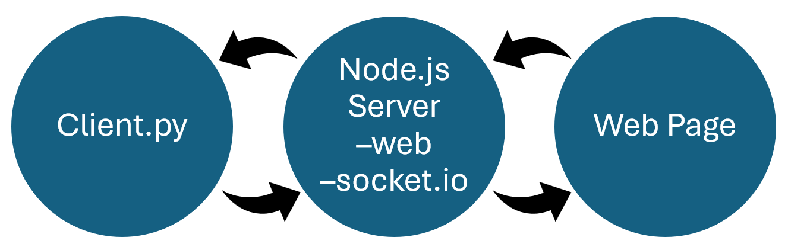

# A Simple Browser - Using `socket.io`

Overview:
This code creates a connection between the localhost website and my machine through python
--- 
## Installation

### 1.  Install `Node.JS`
- Visit https://nodejs.org/en
- Download the installer for windows from the website
- Open the installer
- Run the installer

### 2. Clone or Download This Repository
- Go to the Github webpage
- Click the green `code` button
- Download a ZIP file of the code
- UnZIP the file

### 3. Download Needed Packages
- Install socket.io using the command `pip install socket.io`
- Install websocket-client using the command `pip install websocket-client`

## Running the Project
- In the file explorer, find the simple_browser_socket file
- Right click the file
- Click the 'Open in Terminal' option
- Duplicate the terminal window
- In one terminal window, enter
    ```
    python client.py
    ```
- In the other terminal window, enter
    ```
    python server_secure.cjs
    ```
- Now, open the machine's browser to https://localhost:8080/index.html

## What's Happening?

### Overview
- The web page takes input via buttons
- These send a message through the Node.JS server to the python code on the machine
- These messages are then routed back through the Node.JS server and display a message on the web page


---
### Node.JS
- Node.JS acts as a host for the web page
- It aids in the communication between https://localhost:8080/index.html and the python code on my machine
---
### Topics

- **chat**
- **direction**
- **reply**  

The python code: 
- Subscribes to the chat and direction topics
- Publishes reply topics

The web page:
- Subscribes to reply topics
- Publishes chat and direction topics
--- 
### index.html
- Takes input through the buttons (Up, Down, Left, Right, Stop)
- The messages are emitted to the server to be receieved by the python code
- Displays replies from the python code in real-time
--- 
### client.py
- Creates client in python that connects to a server at https://localhost:8080, creating a connection between the web page and the machine
- Receives messages from the web page in real-time
- Subscribes to chat and direction messages
- Publishes replies to be routed to the web page
---
